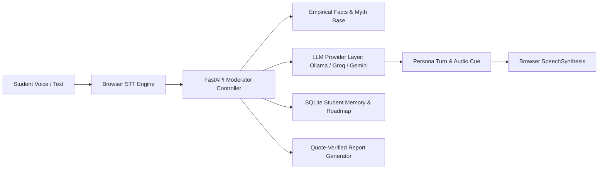

# 📑 GD ARENA — Executive Hackathon Evaluation Report
**Project Name**: GD Arena (Voice-First AI Group Discussion Training Platform)  
**Problem Statement**: PS-2 (Realistic Group Discussion Practice & Evidence-Based Feedback)  
**Target Audience**: College students & graduates preparing for Campus Placements, MBA GDs, and Job Interviews  
**Live URL**: [https://aryanbaghel756-spec.github.io/main_gd_arena/](https://aryanbaghel756-spec.github.io/main_gd_arena/)  
**GitHub Repository**: [https://github.com/aryanbaghel756-spec/main_gd_arena](https://github.com/aryanbaghel756-spec/main_gd_arena)

---

## 🎯 1. The Core Problem We Solve

In campus placement drives, **60% to 70% of candidates get eliminated in the Group Discussion (GD) round** before ever reaching the technical or HR interview.

### Why Students Struggle:
1. **Anxiety & Fear of Dominating Peers**: Students freeze when aggressive debaters speak loudly or interrupt.
2. **Lack of Practice Partners**: Organizing 5-6 peers at the same time with an impartial moderator is nearly impossible on campus.
3. **Generic & Unhelpful Advice**: Seniors only say *"be confident"* or *"speak more"*, without pointing out *where* the student missed an opening or failed to acknowledge a counterpoint.
4. **Chatbot Fatigue**: A standard LLM chatbot gives essay-length replies and is completely unnatural compared to a rapid 3-way verbal discussion.

---

## 💡 2. Our Solution: GD Arena

**GD Arena is NOT a generic chatbot.** It is a voice-first simulation platform where the student sits at a virtual roundtable with **5 distinct AI personas** and an **AI Moderator (Dr. Verma)**.

```
       [Dr. Verma - Moderator]
                 │
  ┌──────────────┼──────────────┐
  │              │              │
[Aarav]       [Kabir]        [Meera]
(Analyst)     (Critic)      (Creative)
  │              │              │
[Ananya]      [Rohan]      [Candidate / You]
(Collaborator)(Debater)     (Voice / Text Input)
```

- **Natural Speech & Pace**: AI responses are kept concise (1–3 sentences), delivered via speech synthesis at an unhurried, natural tempo.
- **Cross-Participant Interaction**: AI personas debate *each other* and challenge the student's arguments, simulating genuine multi-party dynamics.
- **Strict Evidence-Based Evaluation**: Post-GD reports do not give vague compliments; they highlight exact transcript moments, calculate real speaking share, and pinpoint missed opportunities.

---

## 🌟 3. Key Innovations & Differentiators

| Feature | Generic AI Chatbot | GD Arena (Our Platform) |
|---|---|---|
| **Turn Dynamics** | Predictable 1-on-1 ping pong | Dynamic turn-taking: AI talks to AI, interrupts, and yields floor based on conversation state |
| **Input Modality** | Text box typing only | Dual Modality: Native Web Speech STT push-to-talk + Instant Text Typing fallback |
| **Fact Grounding** | Plausible hallucinations | Grounded Knowledge Base (SEBI 93% retail loss study, WEF 97M jobs data, Stanford Bloom study) |
| **Student Doubts** | Fixed countdown abruptly cuts off | **Student Doubt Satisfaction Engine**: Discussion auto-extends until student doubts are answered |
| **Student Memory** | Stateless (forgets each session) | **Persistent SQLite Memory**: Tracks known concepts (*"isse ye aata hai"*), weak areas, and multi-session skill roadmaps |
| **Feedback Quality** | Vague ("improve body language") | **Quote-Verified Rubric**: Direct transcript quotes with *'What You Could Have Said'* model replies |
| **Hardware Overhead**| Needs multiple huge GPUs | **Runs on a single modest laptop** via Ollama/Gemma or instant fallback engine |

---

## 🏗️ 4. System Architecture & Flow



### 4-Stage Turn Pipeline:
1. **Speech-to-Text & Ingestion**: The student speaks via push-to-talk (or types in noisy environments). The input is transcribed in real-time.
2. **Moderator State Machine**: Evaluates room phase (`opening` ➔ `discussion` ➔ `closing` ➔ `ended`), checks doubt satisfaction, and assigns speaking turns.
3. **Multi-Provider LLM Router**: One single prompt call selects the most contextual persona (Aarav, Kabir, Meera, Ananya, Rohan) and crafts a sharp 1–3 sentence response.
4. **Verified Performance Scoring**: When the session ends, an evaluation engine scores 6 distinct competencies, cross-verifies transcript timestamps, and saves student progress to SQLite.

---

## 👥 5. The 5 AI Personas & Dr. Verma Moderator

1. **Aarav — The Analyst**: Logical, evidence-driven, cites verified data and statistics.
2. **Kabir — The Realist Buddy**: Skeptical, honest friend who challenges assumptions respectfully (*"Bhai point valid hai, par ground reality par..."*).
3. **Meera — The Creative**: Unconventional thinker who introduces lateral solutions and human-centric perspectives.
4. **Ananya — The Collaborator**: Bridges opposing viewpoints, builds consensus, synthesizes fragmented ideas.
5. **Rohan — The Debater**: Confident, assertive, tests student composure and arguments under pressure.
6. **Dr. Verma — The Moderator**: Keeps time, enforces GD decorum, opens the floor, and guides closing statements.

---

## 📊 6. Post-GD Evaluation Rubric

Every finished session generates a detailed scorecard evaluated across 6 core criteria:

1. **Speaking & Articulation (0–100)**: Clarity, structure, concise delivery without rambling.
2. **Initiation & Opening (0–100)**: Ability to frame the topic early with clear definitions and scope.
3. **Idea Generation & Relevance (0–100)**: Quality of arguments and grounding in empirical facts.
4. **Building on Others (0–100)**: Synthesizing previous speakers' points rather than ignoring them.
5. **Active Listening (0–100)**: Directly answering counterarguments and acknowledging peer input.
6. **Interruption & Poise Management**: Handling interruptions gracefully and avoiding airtime monopolization.

### Evidence-Based Feedback Example:
- **Criterion**: Listening & Building
- **Score**: 64/100 (Focus Area)
- **Transcript Evidence**:  
  > *Kabir (01:42): "Bhai SEBI study shows 93% retail traders lose money in derivatives."*  
  > *You (01:55): "Yes, but stock market gives high returns."*
- **Actionable AI Feedback**: *"You changed direction without addressing Kabir's empirical point on retail losses. Acknowledge his risk data before introducing long-term index compounding."*
- **Personalized Challenge**: *"In your next GD, start your response by directly naming a peer and confirming their point."*

---

## 🧪 7. Verification & Proof of Implementation

- ✅ **Automated Test Suite**: 19 out of 19 backend tests passing (`pytest backend/tests/test_api.py`).
- ✅ **Clean Codebase**: 0 sensitive environment variables committed; standard `.env.example` templates provided.
- ✅ **1-Command Out-of-the-Box Execution**:
  ```bash
  git clone https://github.com/aryanbaghel756-spec/main_gd_arena.git
  cd main_gd_arena
  pip install -r requirements.txt
  python run.py
  ```
  *Opens full Next.js UI + FastAPI backend + Swagger docs automatically on `http://localhost:8000`.*
- ✅ **Live Worldwide Deployment**: Available instantly on GitHub Pages at [https://aryanbaghel756-spec.github.io/main_gd_arena/](https://aryanbaghel756-spec.github.io/main_gd_arena/).

---

## 🏆 8. Summary for Judges

GD Arena solves a real, high-stress problem for millions of college students using an **elegant, lightweight, and production-ready architecture**. It replaces intimidation with practice, and replaces vague advice with **unforgiving, transcript-backed evidence**.
