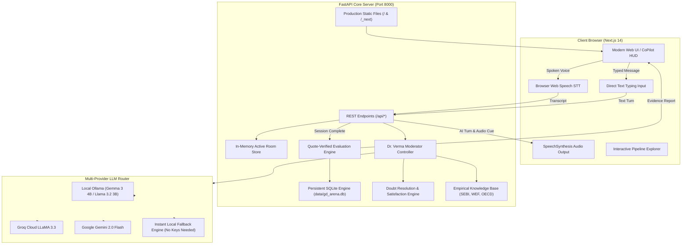

# 🎙️ GD Arena — Voice-First AI Group Discussion Practice Platform

[](https://www.python.org/downloads/)
[](https://fastapi.tiangolo.com)
[](https://nextjs.org)
[]()
[]()

> **Built for Campus Placements & Interview Prep (Problem Statement 2)**  
> GD Arena is a voice-first AI Group Discussion practice platform where students discuss real-world topics with **5 distinct AI personas** and an **AI Moderator** in real time, followed by an **evidence-based performance evaluation report** with personalized improvement roadmaps.

---

## ⚡ Quick Start for Judges & Users (1 Command)

No complex setup or database installation needed. The repository includes the pre-compiled production Next.js frontend embedded directly inside FastAPI.

### 1. Clone & Install Dependencies
```bash
git clone https://github.com/aryanbaghel756-spec/main_gd_arena.git
cd main_gd_arena
pip install -r requirements.txt
```

### 2. Run the Platform
```bash
python run.py
```

That's it! Your browser will automatically open:
- **Interactive Web App**: [http://localhost:8000](http://localhost:8000)
- **Interactive System Architecture & Pipeline**: [http://localhost:8000/#pipeline](http://localhost:8000/#pipeline)
- **FastAPI Interactive Docs (Swagger)**: [http://localhost:8000/docs](http://localhost:8000/docs)
- **Lightweight Test Playground**: [http://localhost:8000/playground](http://localhost:8000/playground)

---

## 🌟 Key Features

1. **Dual Input Modality (Voice & Type Text)**:
   - Voice-first interaction with real-time Speech-to-Text (STT) and automatic speech synthesis (TTS).
   - Direct text typing fallback box for noisy environments or devices without microphones.
2. **5 Distinct AI Personas (Single-Model Driven)**:
   - **Aarav (The Analyst)**: Evidence-oriented, cites studies and numbers.
   - **Meera (The Creative)**: Unconventional thinker, focuses on human experience and creative pivots.
   - **Kabir (The Realist / Critic)**: Ground reality challenger, identifies risks and bottlenecks.
   - **Ananya (The Collaborator)**: Synthesizes viewpoints, bridges opposing arguments.
   - **Rohan (The Debater)**: Persuasive, confident, challenges assumptions.
   - **Dr. Verma (The Moderator)**: Manages speaking turns, enforces GD rules, guides closing arguments.
3. **Empirical Fact Grounding & Myth Busting**:
   - Injects verified real data (World Economic Forum, SEBI F&O Retail Loss study, Stanford Bloom study).
   - Debunks common myths with evidence so discussions stay substantive.
4. **Student Doubt & Query Satisfaction Engine**:
   - GD does not terminate abruptly while the student has active doubts.
   - Moderator and peers address queries until the student marks `satisfied=true`.
5. **Persistent Student Memory & Dynamic Roadmap (SQLite)**:
   - Tracks mastered concepts across sessions (*"isse ye topic aata hai"*).
   - Automatically builds an evolving skill roadmap tailored to student weaknesses.
6. **Transcript-Linked Evidence Evaluation Report**:
   - Generates scores for Speaking, Listening, Idea Generation, Building, and Moderation.
   - Quotes exact transcript timestamps as proof of feedback.
   - Generates actionable 3-step personalized improvement plan.
7. **Production Next.js Dark-Themed Frontend**:
   - Hexagonal radar visualization, audio waveform visualizer, CoPilot HUD suggestions, and live transcription feed.
   - Built-in System Architecture & Pipeline visualizer for judges.

---

## 🏗️ System Architecture



---

## 🔌 API Endpoints Summary

| Method | Endpoint | Description |
|---|---|---|
| `GET` | `/api/health` | Healthcheck & active LLM provider status |
| `GET` | `/api/topics` | Get curated GD topics with difficulty and domains |
| `POST` | `/api/topics/custom` | Create a custom topic with dynamic heuristics |
| `POST` | `/api/rooms` | Create new discussion room with panel size and format |
| `GET` | `/api/rooms/{id}` | Fetch current live room status and participants |
| `POST` | `/api/rooms/{id}/join` | Multi-seat friend joining into existing room |
| `POST` | `/api/rooms/{id}/next-turn` | Advance conversation turn (voice/text input) |
| `POST` | `/api/rooms/{id}/satisfaction` | Update student doubt clearance status |
| `GET` | `/api/rooms/{id}/facts` | Citable empirical facts and debunked myths |
| `POST` | `/api/rooms/{id}/end` | End GD and generate evidence-based report |
| `GET` | `/api/students/{id}/profile` | Student memory, known concepts, weak areas |
| `GET` | `/api/students/{id}/roadmap` | Personalized multi-session learning roadmap |

---

## 🧪 Running Automated Tests

Run the complete test suite verifying all 19 endpoints, quote verification, and satisfaction engine:

```bash
pytest backend/tests/test_api.py -v
```

All 19 tests will pass out-of-the-box in mock mode without requiring external API keys.

---

## ⚙️ Optional: Connect Real LLMs

By default, GD Arena runs smoothly with its high-fidelity internal engine. To connect real AI models:

1. Copy `.env.example` to `.env`:
   ```bash
   cp backend/.env.example backend/.env
   ```
2. Configure your preferred provider:
   - **Local Ollama**: Set `LLM_PROVIDER=ollama` and `OLLAMA_MODEL=gemma3:4b`
   - **Groq Cloud**: Set `LLM_PROVIDER=groq` and `GROQ_API_KEY=your_key`
   - **Google Gemini**: Set `LLM_PROVIDER=gemini` and `GEMINI_API_KEY=your_key`

---

## 👥 Persona Dynamics

| Name | Role | Speaking Style | Placement Trait Tested |
|---|---|---|---|
| **Aarav** | The Analyst | Structured, data-backed, calm | Ability to counter cold facts |
| **Meera** | The Creative | Innovative, empathetic, fresh | Lateral thinking and creativity |
| **Kabir** | The Realist Buddy | Practical, identifies risks, friendly | Handling realistic skepticism |
| **Ananya** | The Collaborator | Constructive, builds bridges, synthesizes | Teamwork and consensus building |
| **Rohan** | The Debater | Passionate, persuasive, challenges | Composure under pressure |
| **Dr. Verma** | The Moderator | Objective, authoritative, polite | Rule adherence & time awareness |

---

## 👥 Authors & Team
Built with ❤️ for College Students preparing for Campus Placements & Interview Success.
